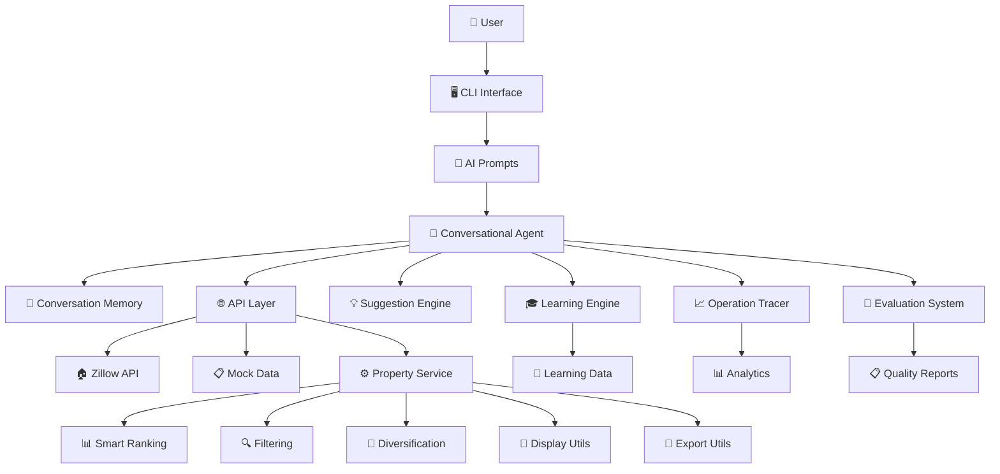

# 🏠 AI Real Estate Agent

> **Smart property search with AI conversations, beautiful exports, and comprehensive evaluation**

A modern TypeScript CLI that finds properties using natural language, ranks them intelligently, and exports stunning reports with built-in quality monitoring.

## 🚀 Quick Start

```bash
# 1. Install & setup
npm install -g pnpm
pnpm install

# 2. Add API key (optional)
echo "OPENAI_API_KEY=your_key_here" > .env

# 3. Start searching!
pnpm run dev
```

*Works immediately with mock data - no API keys required!*

## ✨ Features

- 🤖 **AI Chat Interface** - Talk naturally: *"Find me condos downtown under $500k"*
- 🧠 **Learning from Interactions** - AI gets smarter with each conversation
- 💡 **Proactive Suggestions** - Smart recommendations without being asked
- 🏠 **Intelligent Search** - Multi-source data with adaptive ranking
- 📊 **Market Intelligence** - Real-time insights, trends, and opportunities
- 📈 **Beautiful Exports** - Stunning HTML reports, enhanced CSV, rich JSON
- ⚡ **Self-Improving System** - Automatic optimization based on performance
- 🔍 **Comprehensive Monitoring** - Quality tracking and evaluation

## 🎯 How It Works

```
You: "Show me 2-bedroom condos in downtown"
AI:  🏠 Found 24 properties! Here are the top matches...
     💡 Smart suggestions: Consider nearby areas, price adjustments
     📊 Market insights: High inventory, good negotiation opportunities
     📈 Quality Score: 89.2% | Performance: ⚡ 1.2s
```

## 🏗️ Architecture Overview

### **High-Level System Architecture**



### **🔄 Data Flow Architecture**

```
┌─────────────────┐    ┌─────────────────┐    ┌─────────────────┐
│   User Input    │───▶│  AI Processing  │───▶│ Search Execution│
│                 │    │                 │    │                 │
│ Natural Language│    │ • Intent Extract│    │ • Multi-API Call│
│ Conversation    │    │ • Context Build │    │ • Data Aggregate│
│ Refinements     │    │ • Learning Apply│    │ • Smart Ranking │
└─────────────────┘    └─────────────────┘    └─────────────────┘
                                ▲                       │
                                │                       ▼
┌─────────────────┐    ┌─────────────────┐    ┌─────────────────┐
│ Proactive       │◀───│ Learning &      │◀───│ Results &       │
│ Suggestions     │    │ Improvement     │    │ Insights        │
│                 │    │                 │    │                 │
│ • Neighborhood  │    │ • Pattern Learn │    │ • Property List │
│ • Price Optimize│    │ • User Profiles │    │ • Market Data   │
│ • Feature Suggest    │ • Success Track │    │ • Quality Scores│
│ • Market Insights    │ • Auto-tune AI  │    │ • Tracing Data  │
└─────────────────┘    └─────────────────┘    └─────────────────┘
```

### **🧠 AI Intelligence Stack**

```
┌─────────────────────────────────────────────────────────────┐
│                    🎯 USER EXPERIENCE LAYER                 │
├─────────────────────────────────────────────────────────────┤
│ CLI Interface │ AI Prompts │ Display Utils │ Export System   │
├─────────────────────────────────────────────────────────────┤
│                   🤖 INTELLIGENCE LAYER                     │
├─────────────────────────────────────────────────────────────┤
│ Conversational │ Learning    │ Proactive    │ Memory         │
│ Agent          │ Engine      │ Suggestions  │ Management     │
├─────────────────────────────────────────────────────────────┤
│                   ⚙️ PROCESSING LAYER                      │
├─────────────────────────────────────────────────────────────┤
│ Property       │ Smart       │ Data         │ Quality        │
│ Service        │ Ranking     │ Validation   │ Assessment     │
├─────────────────────────────────────────────────────────────┤
│                   🌐 DATA & INTEGRATION LAYER              │
├─────────────────────────────────────────────────────────────┤
│ API Clients    │ Mock Data   │ Tracing      │ Evaluation     │
│ (Zillow, etc.) │ Generator   │ System       │ Framework      │
└─────────────────────────────────────────────────────────────┘
```

### **🎛️ Core Components**

#### **🤖 AI Agent System**
- **`ConversationalAgent`**: Main AI orchestrator with OpenAI integration
- **`ConversationMemory`**: Maintains context across user interactions
- **`LearningEngine`**: Learns from successful conversations and user patterns
- **`ProactiveSuggestionEngine`**: Generates intelligent recommendations

#### **🏠 Property Intelligence**
- **`RealEstateApiClient`**: Multi-source data aggregation with fallback
- **`PropertyService`**: Advanced ranking, filtering, and diversification
- **Smart Scoring**: Value assessment, freshness, and market position
- **Market Analysis**: Price trends, inventory insights, seasonal patterns

#### **📊 Quality & Performance**
- **`OperationTracer`**: Real-time performance monitoring
- **`EvaluationRunner`**: Comprehensive quality assessment
- **Learning Analytics**: Pattern success rates and optimization metrics
- **Automated Testing**: Continuous conversation and search evaluation

#### **🎨 User Experience**
- **`AIPrompts`**: Intelligent conversation flow management
- **`DisplayUtils`**: Rich property presentation with insights
- **`ExportUtils`**: Professional reports (HTML, CSV, JSON)
- **Proactive Display**: Smart suggestions and market insights

### **🔄 Learning & Adaptation Loop**

```
Conversation ──┐
              ├──▶ Evaluation ──▶ Learning ──▶ Optimization ──┐
Search Results ─┘                                            │
                                                             │
Enhanced AI ◀── Personalization ◀── User Profiles ◀────────┘
```

1. **Data Collection**: Every conversation and search is tracked
2. **Quality Evaluation**: Automated assessment of AI performance
3. **Pattern Learning**: Successful interactions become templates
4. **User Profiling**: Individual preferences and behavior patterns
5. **AI Enhancement**: Model parameters and conversation style adaptation
6. **Proactive Intelligence**: Smart suggestions and market insights

### **🌊 Request Flow Example**

```
User: "Find condos downtown under $400k"
   │
   ▼
🤖 AI Agent
   ├── Extract criteria (location, type, price)
   ├── Apply learned preferences (past successful searches)
   ├── Enhance with user profile (typical features, style)
   │
   ▼
🌐 API Layer
   ├── Parallel search: Zillow + fallback to Mock
   ├── Data validation and enrichment
   ├── Caching for performance
   │
   ▼
⚙️ Property Service
   ├── Smart filtering (criteria + market intelligence)
   ├── Advanced ranking (value, freshness, user preferences)
   ├── Diversification (variety across price/type/features)
   │
   ▼
💡 Intelligence Layer
   ├── Generate proactive suggestions (alternative areas, features)
   ├── Market insights (price trends, inventory analysis)
   ├── Follow-up questions (refinement opportunities)
   │
   ▼
🎨 Presentation
   ├── Rich property display with highlights
   ├── Smart suggestions with confidence scores
   ├── Market insights and timing advice
   ├── Learning progress indicators
```

### **🔧 Integration Points**

- **External APIs**: Zillow (primary), extensible for additional sources
- **AI Services**: OpenAI GPT models with optimized prompts
- **Data Persistence**: JSON-based learning data with automatic cleanup
- **Export Formats**: HTML, CSV, JSON with rich metadata
- **Monitoring**: Real-time tracing and comprehensive evaluation

### **🚀 Scalability & Extension**

The architecture supports easy extension:
- **New AI Agents**: Modular agent system for specialized tasks
- **Additional APIs**: Standardized client interface
- **Enhanced Learning**: Pluggable learning algorithms
- **Custom Suggestions**: Extensible suggestion engine
- **Advanced Analytics**: Rich tracing data for insights

## 🛠️ Setup Options

### Option 1: Mock Data (Instant)
```bash
echo "USE_MOCK_DATA=true" > .env
pnpm run dev  # Ready to go!
```

### Option 2: Real Data (Optional)
```bash
# Get keys from:
# - OpenAI: platform.openai.com
# - RapidAPI: rapidapi.com (for Zillow)

echo "OPENAI_API_KEY=your_key" > .env
echo "ZILLOW_API_KEY=your_key" >> .env
```

## 📁 Project Structure

```
src/
├── 🤖 agents/                    # AI Intelligence System
│   ├── conversationalAgent.ts   # Main AI orchestrator
│   ├── conversationMemory.ts    # Context & session management
│   ├── learningEngine.ts        # 🧠 Learning from interactions
│   └── proactiveSuggestionEngine.ts # 💡 Smart suggestions
├── 🏠 api/                      # Property Data Sources  
│   └── realEstateApi.ts         # Multi-API client (Zillow, Mock)
├── 📊 evals/                    # Quality & Performance
│   ├── conversationEvals.ts     # AI conversation assessment
│   ├── propertyEvals.ts         # Search quality evaluation
│   └── evalRunner.ts            # Comprehensive testing
├── 🔍 tracing/                  # Performance Monitoring
│   └── operationTracer.ts       # Real-time performance tracking
├── 💼 services/                 # Business Logic
│   └── propertyService.ts       # Smart ranking & processing
├── 🎨 utils/                    # User Experience
│   ├── display.ts               # Rich property presentation
│   └── export.ts                # Professional reports
├── 🖥️ cli/                     # Command Line Interface
│   ├── aiPrompts.ts             # Enhanced AI interactions
│   └── prompts.ts               # Traditional CLI prompts
├── 📋 examples/                 # Demonstrations
│   ├── integrationExamples.ts   # API integration examples
│   └── learningDemo.ts          # 🎯 Learning features demo
├── ⚙️ config/                  # Configuration
└── 🔧 types/                   # TypeScript definitions
```

## 🔧 Commands

```bash
pnpm run dev                # 🚀 Start the enhanced AI agent
pnpm run build              # 📦 Build for production
pnpm run demo:learning      # 🧠 Demo learning & suggestions features
pnpm run eval               # 📊 Run full evaluation suite
pnpm run eval:conversation  # 🤖 Test AI conversation quality
pnpm run eval:property      # 🏠 Test search performance
```

## 📊 Evaluation Dashboard

Get real-time insights into your AI agent's performance:

```
📊 EVALUATION DASHBOARD
🎯 Overall Score: 87.3%

📈 Score Breakdown:
  🤖 Conversation Quality: 89.1%
  🏠 Property Search: 85.7%  
  ⚡ Performance: 87.2%

💡 Recommendations:
  1. Improve AI response times
  2. Enhance result diversification
```

### 🔍 What Gets Evaluated
- **🤖 Conversation Quality** - Accuracy, relevance, helpfulness metrics
- **🏠 Search Performance** - Relevance, diversity, ranking evaluation  
- **⚡ Real-time Monitoring** - API performance, response times, error tracking
- **📊 Automated Testing** - Continuous monitoring and alerting

## 📸 What You'll Get

### Beautiful Exports
- **🌐 HTML Reports** - Professional property showcases
- **📈 Enhanced CSV** - Emoji headers, calculated fields  
- **📊 Rich JSON** - Market insights, recommendations

### Smart Features
- **🎯 Match Scoring** - Properties ranked by your preferences
- **💡 Highlights** - Key selling points automatically detected
- **📈 Market Analysis** - Price trends and investment ratings
- **🏆 Top Picks** - Best value, newest, highest-rated properties

### Production Monitoring
- **📊 Quality Metrics** - Track AI conversation accuracy
- **⚡ Performance Tracking** - Monitor response times and errors
- **🔍 Evaluation Reports** - Comprehensive system health insights
- **📈 Continuous Improvement** - Data-driven optimization suggestions

## 🚀 Next Steps

1. **Try it now**: `pnpm run dev` - Experience the enhanced AI agent
2. **See learning features**: `pnpm run demo:learning` - Watch AI learn and suggest
3. **Export results**: Choose HTML for beautiful reports
4. **Monitor quality**: Run `pnpm run eval` to see performance metrics
5. **Add real data**: Get API keys for live property data

---

**Built for developers** who want production-ready AI applications with intelligent learning, proactive suggestions, and comprehensive monitoring.

### 📚 **Documentation**
- [🧠 Learning & Suggestions Guide](./LEARNING_FEATURES.md) - New AI capabilities
- [📖 Evaluation Guide](./EVALUATIONS_AND_TRACING_GUIDE.md) - Quality monitoring
- [⚙️ Setup Guide](./SETUP_ENV.md) - Environment configuration